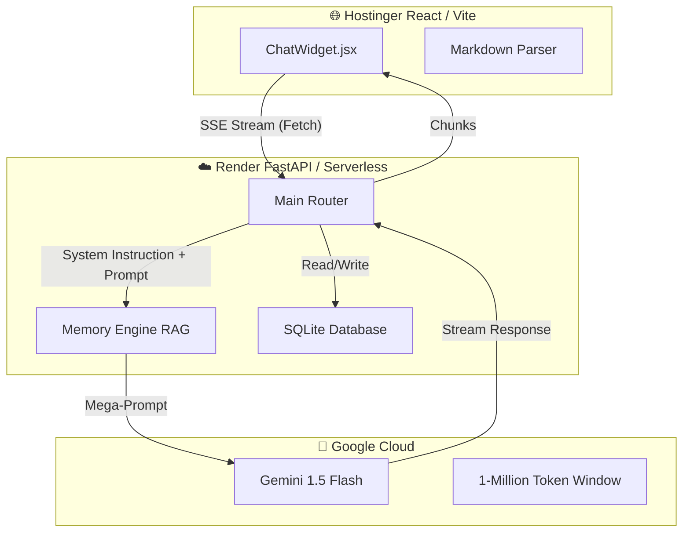

# 🧠 Arquitectura del Asistente Portafolio AI

Este documento detalla la estructura y el funcionamiento del Asistente Chatbot Serverless de Diego J. Peña Casadiegos, diseñado con una arquitectura de inyección dinámica superando las limitaciones tradicionales de bases de datos vectoriales.

---

## 1. Topología del Sistema 

El proyecto consta de tres pilares principales que se comunican en tiempo real mediante **REST APIs** y flujos continuos de datos (**Server-Sent Events / SSE**):

---

## 2. El Cerebro: El Sistema RAG 2.0 (In-Context Memory)

El concepto **RAG (Retrieval-Augmented Generation)** tradicional fue reescrito para adaptarse agresivamente a las limitaciones de un servidor gratuito (*Free-Tier*) y evitar las restricciones de llaves API.

### Así funciona:
1. **Fase de Ingestión (Arranque):** Cuando el servidor de Render se enciende, un motor interno (`rag.py`) escanea tu carpeta silenciosa `backend/data/`.
2. **Rompearchivos Nativos:** Usando `PyPDF2` (para leer tus hojas de vida `.pdf`), además de gestores de texto `.txt` y `.md`, extrae el texto puro y lo une todo en una sola variable gigante de RAM que llamamos el **Mega-Prompt**.
3. **Inyección Dinámica:** No usamos fragmentadores ni calculamos vectores complejos. Dado que Gemini Flash soporta genéticamente **1 Millón de Tokens**, incrustamos *toda tu historia y curriculum* en las instrucciones del sistema del bot (`system_instruction`). 

> **💡 Ventaja:** El Chatbot no tiene que buscar textos parecidos (Vector Search). Él se *aprende todo tu perfil de memoria* en un milisegundo antes de siquiera responder. 

---

## 3. Almacenamiento de Conversaciones (Memoria Histórica)

Tus conversaciones no se evaporan al cerrar el navegador.

*   **Motor de Base de Datos:** **SQLite** de forma asíncrona mediante `aiosqlite` y `SQLAlchemy`.
*   **Archivos Físicos:** Todo lo que tu bot lee, escucha o responde se guarda automáticamente en `backend/storage/portfolio.db`.
*   **Tablas Maestras:**
    *   `Conversations`: Guarda IDs únicos, los títulos automáticos de cada charla y fechas.
    *   `Messages`: Ancla cada frase escrita por tu sistema (`role: assistant`) y del visitante (`role: user`) a una `Conversation ID` específica.

*Nota de Producción:* Los servidores gratuitos de Render aplican un formateo del disco cada vez que se duermen (por inactividad). Esto significa que las conversaciones en `portfolio.db` son efímeras (solo viven mientras la máquina hable en el día) brindando privacidad intrínseca total a tus empleadores y limpiando la basura estática del servidor de forma natural.

---

## 4. Frontend: Renderización Holográfica (React)

El módulo visual que interactúa con las personas (`ChatWidget.jsx`) es la punta de la flecha:
*   **Framer Motion:** Se encarga de las animaciones elásticas de rebote, encogimiento y expansión suave de la interfaz flotante.
*   **CSS Dinámico:** Utiliza `calc(100vw - 32px)` y breakpoints (`sm:x`) de TailwindCSS para saber cuándo un visitante lo abre desde un iPad/Escritorio (manteniéndolo como un widget flotante de `384px`) o desde un Teléfono Celular (Apropiándose del 100% de la pantalla táctil como una app nativa en `78dvh` garantizando el uso cómodo del teclado).

## 5. Web Scraping Dinámico Localizado
En el Backend implementamos `tools=[fetch_url]` que habilitan al modelo subyacente para poder leer Internet por ti a través de `BeautifulSoup4`. Si tu visitante proporciona un link en el chat solicitando que lea de dónde vienen (por ejemplo, el link de su empresa), el robot usa herramientas preprogramadas en Python para navegar su DOM, leer el texto y contestar asertivamente todo dentro del ecosistema del Chatbot.
